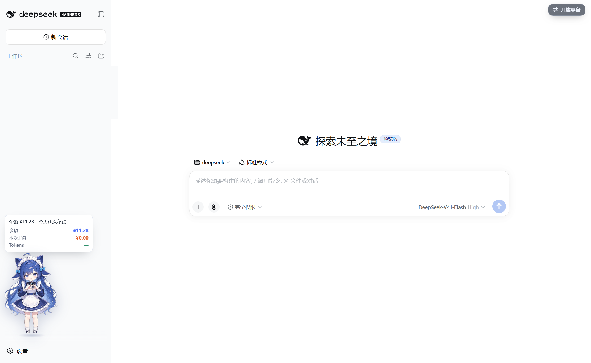
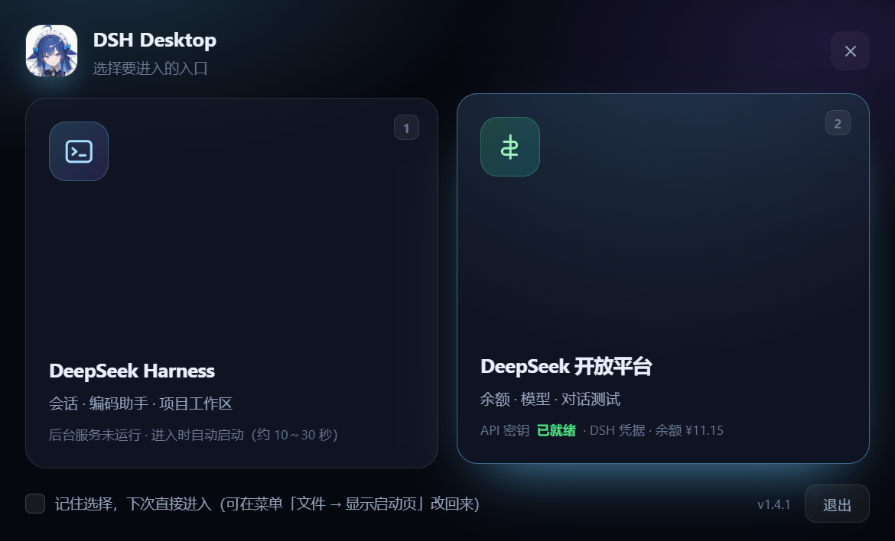

# DSH Desktop

> 把 [DeepSeek Harness](https://github.com/deepseek-ai) 的 `dsh web` 界面封装成一个**独立桌面应用**（Electron）：
> 双击图标打开启动页，选择进入 **DeepSeek Harness**（会话 / 编码助手）或 **DeepSeek 开放平台**（余额 / 模型 / 对话测试）。
> 没有浏览器地址栏、没有标签页，有独立任务栏图标、窗口记忆，还有一个会动的 Q 版助手在侧栏提醒你余额与用量。



## 特性一览

| | |
| --- | --- |
| **启动页** | 两张卡片选入口，实时显示服务状态、API 密钥来源与余额；可「记住选择」 |
| **Q 版助手** | 左侧栏的全身角色，漂浮 + 呼吸 + 摇摆动画，可拖动，气泡提醒 **余额 / 本次消耗 / Tokens** |
| **开放平台面板** | 余额、模型列表、流式对话测试、密钥管理（自动复用 DSH 已保存的密钥） |
| **视图互切** | Harness ⇄ 开放平台双向切换（按钮 / 菜单 / `Ctrl+Shift+P`），切换是隐藏不销毁 |
| **独立后台服务** | 用 WMI + wscript 拉起，**不属于应用的进程树**：关掉/重启应用不会断会话，也不弹黑窗 |
| **零配置启动** | 自动探测端口、自动复用已有服务、无服务时自动启动并解析启动令牌 |

## 界面预览

启动页（选择入口，卡片上带实时状态）：



Harness 界面 + 左侧栏的 Q 版助手（气泡显示余额 / 本次消耗 / Tokens）：


## 快速开始

需要本机已装 Node.js 与 DeepSeek Harness：

```powershell
npm i -g @deepseek-ai/dsh     # 安装 DSH
git clone https://github.com/terrycool11/dsh-desktop.git
cd dsh-desktop
npm install                   # 约 400 MB（Electron 运行时）
npm run package               # 打包到 dist/
npm run shortcut              # 在桌面创建快捷方式
```

开发模式与改动后重新打包：

```powershell
npm start                     # 直接跑起来（改代码即时生效）
npm run selftest:launcher     # 无头自检：启动页 + Q 版助手 + 视图切换 + 开放平台
npm run package:staged        # 打包到 dist-new/
npm run update:entry          # 放出桌面「更新 DSH Desktop」入口
```

> 打包后是**自包含**的：`dist/` 里带完整 Electron 运行时，可以整个文件夹拷走。

## 它是怎么工作的

DSH 的 Web 界面带**启动令牌**保护：每次 `dsh web` 启动都会随机生成一个 token，
只打印在标准输出里（`dsh web: http://127.0.0.1:3080/?token=...`），
浏览器第一次访问该地址后才会写下鉴权 Cookie。

所以桌面端不能"凭空接入"一个别人的服务，它的做法是：

1. **优先复用**：`runtime.json` 里记着上次服务的 pid 与带令牌 URL，进程还活着就直接用 —— 秒开，不重新加载插件。
2. **自己拉起**：否则执行 `dsh web --no-open --port <端口>`，从输出里解析那行 URL 再加载。
3. **端口冲突让路**：首选端口被占用时自动改用下一个空闲端口。

### 服务是真正独立的

应用不直接 `spawn` 服务，而是写一个启动脚本，再用 **WMI（`Win32_Process.Create`）** 创建 ——
这样服务的父进程是 `WmiPrvSE.exe` 而不是本应用，不在 Electron 的 job 对象里：

```
WmiPrvSE ──创建──> wscript.exe（GUI 程序，不分配控制台 → 不弹黑窗）
                       └─隐藏窗口运行─> cmd.exe ──> node.exe（dsh web 服务）
```

- 直接用 WMI 起 `cmd.exe` 会在用户会话里分配 conhost，**弹出黑色终端窗口**，
  所以外面包一层 `wscript`（GUI 子系统程序，本身不创建控制台）。
- 启动脚本与 VBS 放在 `%TEMP%\dsh-launch-server-<端口>.{cmd,vbs}`，服务日志在 `%APPDATA%\DSH Desktop\server-<端口>.log`。
- 回退链：没有 `wscript.exe` → 直接 WMI 起 cmd；WMI 不可用 → 直接 `spawn`。

> 实测：强杀应用后服务仍在监听端口，重启应用日志出现 `reusing previous server`，服务 pid 完全没变。

## Q 版助手（左侧栏）

打开 Harness 后，左侧栏会出现一个**完整的全身 Q 版角色**：持续**漂浮 + 呼吸 + 轻微摇摆**，
脚下有随浮动缩放的影子；鼠标可以把它**拖到任意位置**（位置记在 `localStorage`），
移上去弹提醒气泡，点一下它会**跳一下**并刷新余额。气泡里是 **余额 / 本次消耗 / Tokens**。

### 形象是怎么来的

用户提供的全身 Q 版立绘（`assets/chibi-source.jpg`，1664×2496），经两步处理：

```
tools/make-chibi-full.ps1
  1. 裁掉右下角水印（裁到 2390 高）
  2. 洪水填充抠掉浅色背景（C# 编译执行，400 万像素秒级）
  3. 缩放到 assets/chibi-full.png（300×431，透明底，201 KB）
```

页面里就一张 ``（显示 140×201），靠 CSS keyframes 做整身动画：

| 动画 | 做法 |
| --- | --- |
| 漂浮 | 外层 `dshFloat` 上下 5px（3.6s） |
| 呼吸 | 图像 `dshBreathe` 以底部为原点 `scaleY(1.014)`（3.6s，与漂浮同周期） |
| 摇摆 | 中层 `dshSway` 慢速 ±1.1°（5.2s），与漂浮不同周期 → 看起来更自然 |
| 影子 | `dshShadow` 随浮动缩小、变淡 |
| 点击 | `dshHop` 跳一下 |

桌宠本体是一个**独立维护的零依赖库**：`harness/pet.js`（来自
[dsh-desktop-pet](https://github.com/terrycool11/dsh-desktop-pet) 项目，同一个文件也能用在
普通网页 / 油猴脚本 / 别的 Electron 应用里）。`harness/mascot-panel.js` 只是**应用侧粘合**：
通过 preload 桥拿到形象和用量、调 `DshPet.create()` 把桌宠挂上去。

**换形象只需替换 `assets/chibi-full.png`**，代码不用动；要改尺寸、动画、气泡文案或数据源，
改 `pet.js` 的配置项（见那个仓库的 README）。

> 早先用"抠图 + 补画下半身"拼过一版，效果不好已删除；`tools/cutout.ps1`、
> `tools/make-chibi.ps1`、`tools/make-mascot.ps1` 保留作参考。

### 三个数字分别从哪来

| 指标 | 来源 | 说明 |
| --- | --- | --- |
| **余额** | 开放平台 `GET /user/balance` | 准确，每 60 秒采样一次 |
| **本次消耗** | 本次运行第一次采样到的余额 − 当前余额 | 统计的是**整个账号**，同一把密钥的其它工具用量也算在内 |
| **今日消耗** | 当天观测到的余额下降累加，存 `usage.json`，跨次运行累计 | 只统计应用运行期间观测到的下降 |
| **Tokens** | 直接读 DSH 界面自己渲染的用量统计（`[data-composer-stats]`，来自 DSH 的 `tokenMeter` 投影） | 准确，但**当前会话有对话后才会出现**，新会话显示 `—` |

> 开放平台**没有**用量/账单查询接口，所以「消耗金额」不是官方数字，而是靠余额下降推算的 ——
> 这是目前唯一可行的办法。想看得更细可以切到开放平台面板（`Ctrl+Shift+P`）。

## 两个视图互相切换

进去之后不用回启动页，两边都能一键切到对方：

| 在哪 | 按钮 | 效果 |
| --- | --- | --- |
| Harness（DSH 界面） | 右上角浮动按钮 **⇄ 开放平台** | 隐藏 Harness，显示开放平台 |
| 开放平台 | 顶栏 **DeepSeek Harness** 按钮 | 隐藏开放平台，唤起 Harness（服务没起就先起） |
| 任意 | 菜单 **开放平台 → ⇄ 在 Harness 与开放平台之间切换** | 同上 |
| 任意 | `Ctrl+Shift+P` | 同上 |

切换是**隐藏而不是销毁**：开放平台里的对话记录、Harness 的会话状态都保留，切回来是瞬时的。
关闭任一窗口时，若另一个窗口也处于隐藏状态，应用会直接退出（避免"点了关闭却没反应"）。

> Harness 那个按钮是**注入**进 DSH 页面的：`harness/preload.js` 只通过 `contextBridge`
> 暴露一个 `dshSwitch.to()` 通道（独立世界，DSH 自己的脚本完全不受影响），
> 并挂了 `MutationObserver` 兜底 —— 万一 DSH 重绘了 `body`，按钮会被自动补回来。

## DeepSeek 开放平台面板

菜单 **开放平台**（快捷键 `Ctrl+1/2/3`）或任意入口打开，是一个独立窗口，三个页签：

| 页签 | 内容 |
| --- | --- |
| 概览 | 账户余额（总余额 / 充值 / 赠金 / 是否可调用）、可用模型列表（上下文长度、最大输出、输入模态、思考档位）、控制台/账单/充值/文档/服务状态快捷入口 |
| 对话测试 | 直接用自己的 API 密钥跑 `chat/completions`：流式输出、思考过程折叠展示、推理强度（`reasoning_effort`）与温度可调、token 用量统计、可随时停止 |
| 设置 | API 密钥的保存 / 清除 / 从 DSH 凭据导入 / 连接测试 |

对接的是官方接口：`GET /user/balance`、`GET /models`、`POST /chat/completions`（`stream: true`）。

### 密钥从哪来

按优先级自动选择：

1. **本应用保存的密钥** —— 用 Windows DPAPI（Electron `safeStorage`）加密后放在
   `%APPDATA%\DSH Desktop\platform.json`，不明文落盘。
2. **DSH 自己的凭据** —— 自动读取 `~/.dsh/.credentials.yaml` 里的 `refs.DEEPSEEK_API_KEY`，
   所以通常**不用配置就能直接用**。

所有请求都由 Electron 主进程发起（渲染进程保持沙箱 + `contextIsolation`，通过 preload 暴露的
IPC 通道调用），既避开了浏览器跨域限制，密钥也不会暴露给页面脚本，更不会离开本机。

## 功能

| 功能 | 说明 |
| --- | --- |
| 启动页 | 选择进 Harness 还是开放平台，可「记住选择」；只去平台时不拉起 dsh 服务 |
| 独立窗口 | 无地址栏/标签页，独立任务栏图标，窗口大小与位置自动记忆 |
| 自动拉起服务 | 服务未运行时自动启动，带启动画面 |
| 服务真正独立 | WMI 创建，父进程是 WmiPrvSE；**重启应用不会断会话**，下次打开秒开复用 |
| 端口自适应 | 首选端口被占用时自动切换到空闲端口 |
| 退出方式可选 | 菜单里可选「退出（后台服务继续运行）」或「退出并结束 DSH 服务」 |
| 开放平台面板 | 余额 / 模型 / 对话测试 / 密钥管理，自动复用 DSH 已保存的 API 密钥 |
| 外链处理 | 站外链接用系统默认浏览器打开，站内导航留在窗口内 |
| 中文菜单 | 文件 / 开放平台 / 视图 / 窗口 / 帮助 |
| 单实例 | 重复启动只会聚焦已有窗口 |
| 安全收尾 | 结束服务前会核对 pid 的命令行确实是 `dsh ... web`，避免 pid 复用误杀别的进程 |
| 日志 | 服务输出与加载过程写入 `%APPDATA%\DSH Desktop\dsh-desktop.log` |

## 目录结构

```
dsh-desktop/
├─ main.js                  Electron 主进程（服务编排 + 窗口 + 菜单 + IPC）
├─ package.json
├─ assets/
│  ├─ chibi-full.png        Q 版助手立绘（透明底，侧栏用）
│  ├─ icon.ico / icon.png   应用图标（9 档尺寸）
│  └─ icon-source.jpg       图标原图
├─ harness/                 Harness 窗口相关
│  ├─ preload.js            只向页面暴露 view:switch / stats / mascot 通道
│  ├─ pet.js                桌宠本体（独立库，与 dsh-desktop-pet 仓库同步）
│  └─ mascot-panel.js       应用侧粘合：拿形象 + 用量，建桌宠
├─ launcher/                启动页（选择 Harness / 开放平台）
│  ├─ launcher.html / .css / .js
│  └─ preload.js
├─ platform/                开放平台面板（独立窗口，沙箱渲染 + preload）
│  ├─ platform.html / .css / .js
│  └─ preload.js            contextBridge 暴露的 IPC 通道
├─ docs/screenshot.png      README 截图
└─ tools/
   ├─ package.js            调用 @electron/packager 打包
   ├─ verify-package.js     校验打包进 asar 的内容
   ├─ update-app.ps1        一键更新（关旧实例 → 换新版 → 重启，带回滚）
   ├─ create-update-shortcut.ps1  放出/移除桌面「更新 DSH Desktop」入口
   ├─ create-shortcut.ps1   创建/删除桌面快捷方式
   ├─ start-web.ps1         另起一个独立的网页版 dsh 服务（可选）
   ├─ prepare-icon.ps1      从原图按尺寸裁剪生成图标素材
   ├─ make-icon.js          打包成多尺寸 ICO（无图形库依赖）
   ├─ make-chibi-full.ps1   立绘去水印 + 抠背景 + 缩放
   └─ cutout.ps1            通用抠图（C# 洪水填充）
```

> `dist/`、`dist-new/`、`.preview/`、`node_modules/` 都是本地产物，已在 `.gitignore` 中排除。

## 换图标

```powershell
# 把新图放到 assets/icon-source.jpg，或用 -Source 指定
npm run icon:image
```

图标是**按尺寸自适应裁剪**的：16～20px 取脸部特写、24～32px 稍放宽、
40～64px 头肩、128～256px 大半身。因为整张半身像直接缩到 16px 只会是一团色块，
小尺寸必须换构图才认得出。裁剪参数在 `tools/prepare-icon.ps1` 顶部的 `Get-Crop` 里，
各档预览图输出在 `assets/generated/preview-<尺寸>.png`，改完对一眼即可。

最终生成 16/20/24/32/40/48/64/128/256 九种尺寸的 `assets/icon.ico`。

> 快捷方式的图标**取自 exe 自身**（`dist\DSH Desktop.exe,0`）。exe 每次更新都会被替换，
> Windows 图标缓存不会按旧键命中，所以更新后图标一定会跟着变；
> 若改了图标想立刻生效，重新打包 + 更新一次即可，必要时跑 `ie4uinit.exe -show`。


## 常用命令

```powershell
# 开发模式运行
npm start

# 自检：启动 → 校验页面加载成功 + 开放平台面板 → 截图 → 退出（退出码 0 表示通过）
npm run selftest

# 自检并真实跑一次流式对话（会消耗少量 token）
npm run selftest:chat

# 重新打包 + 重建桌面快捷方式
npm run package
npm run shortcut

# 校验打包内容
npm run verify

# 删除桌面快捷方式
powershell -ExecutionPolicy Bypass -File tools/create-shortcut.ps1 -Uninstall
```

### 程序正在运行时如何更新

正在运行的实例会锁住 `dist` 目录，直接打包会报 `EBUSY`。这时可以打包到临时目录，
只替换里面的 `resources/app.asar`（几百 KB，代码全在里面，Exe 与 Electron 运行时不用动）：

```powershell
node tools/package.js --out dist-build
Copy-Item "dist-build\DSH Desktop-win32-x64\resources\app.asar" `
          "dist\DSH Desktop-win32-x64\resources\app.asar" -Force
Remove-Item dist-build -Recurse -Force
```

替换后**下次启动**生效；正在运行的窗口不受影响。若图标或 Exe 元数据也改了，就得先关掉程序再完整打包。

### 一键更新（推荐）

```powershell
# 1) 打包新版本到 dist-new
npm run package -- --out dist-new

# 2) 桌面出现「更新 DSH Desktop」入口后，双击它即可：
#    关闭旧实例 → 换上 dist-new → 刷新快捷方式 → 重新启动
#    命令行等价于：
powershell -ExecutionPolicy Bypass -File tools/update-app.ps1
```

更新器带失败回滚（替换失败会把旧版本挪回来），可用 `-NoRestart`、`-KeepBackup`、
`-Source/-Target` 控制行为；`-SkipClose`、`-SkipShortcut` 供测试用。

> ⚠️ 关闭应用会**连带结束后台 dsh web 服务**（服务是应用的子进程，会被 Windows 的
> job 对象一起回收），所以正在进行的会话会断开一下。会话数据保存在 `~/.dsh`，
> 重开后在侧栏点一下就能继续。

### 更新期间用网页版兜底

如果想在更新期间保留一个不受应用退出影响的入口，可以另起一个**独立**的网页版服务
（用 WMI 创建，父进程是 WmiPrvSE，不在应用的进程树里）：

```powershell
powershell -ExecutionPolicy Bypass -File tools/start-web.ps1
```

它会在 `%TEMP%\dsh-web-<端口>.log` 里读到带 token 的地址，并在桌面放置
「DSH 网页版」入口（`.url`，用默认浏览器打开）。网页版与桌面版共用 `~/.dsh`，
看到的是同一批会话 —— **不需要导出/导入**。同一会话建议只在一个入口里操作，避免冲突。

## 配置

配置文件：`%APPDATA%\DSH Desktop\config.json`（首次运行自动生成）

```json
{
  "host": "127.0.0.1",
  "port": 3080,
  "workspace": "D:\\deepseek",
  "killServerOnQuit": false,
  "zoom": 1,
  "bounds": { "x": 100, "y": 80, "width": 1500, "height": 950 }
}
```

| 字段 | 说明 |
| --- | --- |
| `port` | 首选端口；被占用时自动顺延 |
| `workspace` | 拉起服务时的工作目录，也就是 DSH 会话的工作区 |
| `killServerOnQuit` | 退出应用时是否**显式**结束后台 DSH 服务。默认 `false`。服务本身是独立进程（见上），所以关窗口不会打断正在跑的任务；要彻底停掉用菜单「文件 → 退出并结束 DSH 服务」 |
| `zoom` | 界面缩放，`1` 为 100% |
| `bounds` | 主窗口位置与大小，关闭时自动写入 |
| `platformBounds` | 开放平台面板窗口的位置与大小，关闭时自动写入 |
| `showLauncher` | 是否显示启动页。设 `false` 时按 `entryChoice` 直接进入 |
| `entryChoice` | `harness` 或 `platform`，配合 `showLauncher: false` 使用（勾选「记住选择」会自动写入） |

> 读配置时会自动剥掉 UTF-8 BOM —— 用记事本之类改过 `config.json` 也不会解析失败。

开放平台自己的密钥存在 `%APPDATA%\DSH Desktop\platform.json`（DPAPI 加密），与 `config.json` 分开。

## 注意事项

- 需要本机已全局安装 DSH：`npm i -g @deepseek-ai/dsh`。
- 如果终端里还开着一个 `dsh web`，桌面版会占用下一个端口。两个服务共享 `~/.dsh`，
  建议日常只用桌面版，避免同一个会话被两边同时打开。
- 默认关窗口**不结束**后台服务（这样长任务不会被掐断）。要彻底停掉：
  菜单「文件 → 退出并结束 DSH 服务」，或把 `killServerOnQuit` 改成 `true`，
  或者直接 `taskkill /IM node.exe`（会杀掉所有 node 进程，慎用）。
- 服务由本应用启动时会在 `%APPDATA%\DSH Desktop\runtime.json` 里记下 `pid` 和带令牌的 URL，
  下次启动只要该进程还活着就直接复用。文件里带 token，注意不要外传。
- 开放平台面板的对话测试是**直接调用你自己的 API 密钥**，会按官方价格计费；
  它只是一个调试窗口，和 DSH 会话本身无关。

## 相关项目

- **[dsh-desktop-pet](https://github.com/terrycool11/dsh-desktop-pet)** —— 桌宠本体被抽出来单独开源了：
  一个 13 KB 的零依赖 JS 库，能用在普通网页（`<script>` 引一行）、油猴脚本、任意 Electron 应用里。
  有在线 Demo：<https://terrycool11.github.io/dsh-desktop-pet/demo/>
  本仓库的 `harness/pet.js` 就是它的副本，改桌宠请去那边改，再同步回来。
